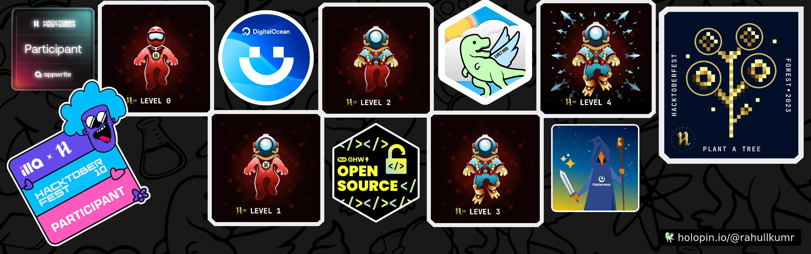

### Hi there 👋
I am Rahul Kumar, Full Stack Developer.

## Skills 
- Python, JavaScript, SQL, Dart
- React, Tailwind, Bootstrap, GSAP, Flutter
- Django, Flask
- MYSQL, SQLite, Mongodb (soon)
  
<!--
     &nbsp;

    &nbsp;

     &nbsp;

    &nbsp;
-->

## Hosted Projects
- Guess Indian states and UTs game [Visit Website](https://rahullkumr.github.io/mini-projects/projects/08_guessIndia.html) | [Code](https://github.com/Rahullkumr/GuessIndianStatesAndUTs/tree/web-version)
- Mini Projects [Visit Website](https://rahullkumr.github.io/mini-projects/) | [Code](https://github.com/Rahullkumr/mini-projects)

## Open Source
- Hacktoberfest2023

<h2 align="center">Stats</h2>

   

    

 

<!--     Snake eating bna lena  -->
 

<!--
Error :
  (should not come again since I changed PAT expiry date to NEVER):
  something went wrong! file an issue at https://tiny.one/readme-stats
  maximum retries exceeded
  Please add an env variable called PAT_1 with your github token in vercel
solution video:
  https://www.youtube.com/watch?v=n6d4KHSKqGk&t=107s
-->

  

  

 

  

    

 

  

<!-- 
 

-->
